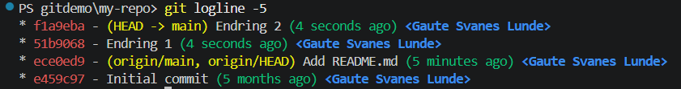
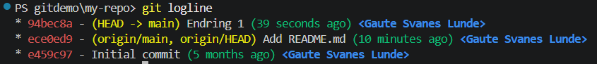
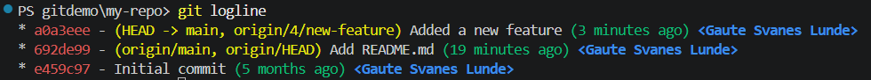
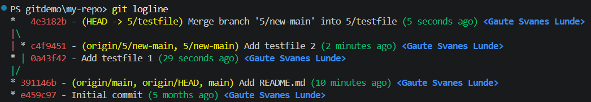
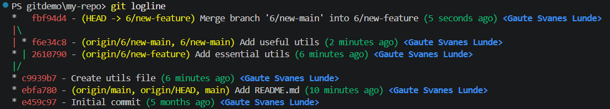
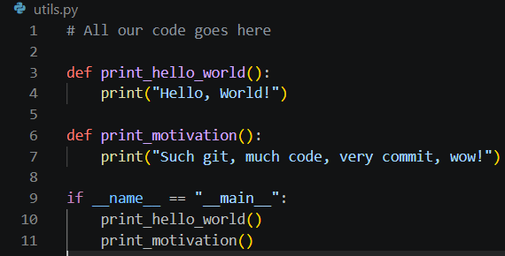
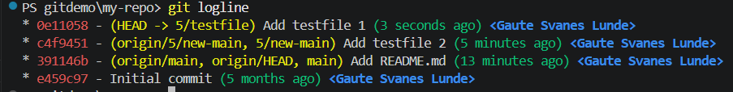
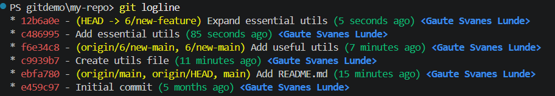

# Git-oppgaver 25.08.2026

I oppgavene under brukes mye kommandoen `git logline` for å se commit-historikken. Dette er en custom kommando som er kort for `git log --graph --pretty=format:'%Cred%h%Creset -%C(yellow)%d%Creset %s %Cgreen(%cr) %C(bold blue)<%an>%Creset' --abbrev-commit`

Du kan lagre dette selv som `git logline` ved å kjøre følgende kommando én gang: 

```sh
git config --global alias.logline "log --graph --pretty=format:'%Cred%h%Creset -%C(yellow)%d%Creset %s %Cgreen(%cr) %C(bold blue)<%an>%Creset' --abbrev-commit"
```

---

### 1 - Lag to commits
Lag en ny fil eller gjør en endring i denne filen og lag en commit med `git commit -m "<melding her>"`.

Oooog gjør det en gang til! 

Historikken burde da se slik ut:


---

### 2 - Reset til forrige commit
Reset siste commit slik at bare den første commiten du lagde blir igjen: 

`git reset <commit-hash>`

Du finner commit-hash med `git logline` eller `git log`.

Dersom du spesifiserer `--hard` setter du mappen til å se ut slik den gjorde ved commiten som spesifiseres. Ellers vil du fjerne *comitten*, men ikke endringene (prøv begge og se forskjellen)

Resultat:


OBS: Commit-hashen vist på bildene kommer ikke til å stemme med de du ser lokalt :D 

---

### 3 - Reset til origin/main
Bruk samme kommando som i oppgave 2, men reset til et branch-navn (`origin/main`) i stedet for en commit-hash.

Hva blir forskjellen på å bruke `main` vs `origin/main`?

---

### 4 - Merge - Fast-forward
Med utgangspunkt i `main`, merge inn den nye featuren som ligger i branchen `origin/4/new-feature`.

Bruk kommandoen `git merge <branch>`.

Siden den nye commiten i `4/new-feature` er basert direkte på `main` trengs ingen merge commit, vi bare flytter `main` til å peke på samme commit som `4/new-feature`

Resultat:


---

### 5 - Merge - Three-way merge
Reset tilbake til `origin/main`.

Lag så en ny branch `5/testfile`, lag en ny fil "testfile1.txt" og lag en commit.

Merge så inn branchen `origin/5/new-main`

Etterpå burde historikken se slik ut:


Siden vi nå skal slå sammen to commits, får vi en merge commit.

---

### 6 - Merge - Merge conflict
Sjekk ut branchen `6/new-feature` med kommandoen `git switch 6/new-feature`, og merge inn branchen `6/new-main`. Resolve merge-konflikten som oppstår slik at historikken ser slik ut:



Og filen ser noenlunde slik ut:


---

### 7 - Rebase 
Gå tilbake til oppgave 5, men bruk `git rebase` i stedet for `git merge`. Resultatet burde se slik ut: 



---

### 8 - Rebase - Merge conflict
Gå tilbake til oppgave 6, men bruk `git rebase` i stedet for `git merge`. Prøv gjerne å lage enda en commit på `6/new-feature` som tukler mer med `utils.py` før du rebaser på `6/new-main`! 

Resultatet burde se slik ut: 


---

### 9 - Amend
Generer en "hemmelig" Guid med `New-Guid` (Powershell) eller `uuidgen` (Unix) og lagre den i en ny fil. Lag så en commit med den nye filen.

Oisann, hemmeligheter skal jo ikke sjekkes inn i koden! Dersom vi lager en ny commit hvor vi sletter eller erstatter den hemmelige strengen, så vil den fremdeles ligge i git-historikken. Ikke bra! Heldigvis har vi ikke pushet commiten til GitHub, så da kan vi endre commiten vår lokalt.

Gjør om på filen slik at den hemmelige strengen erstattes med `<secret>`, og gjør om commiten med `git commit --amend`.

OBS: Med `--amend` så *endrer* vi ikke commiten, vi *erstatter den med en helt ny*. Aldri --amend en commit som er pushet til GitHub etc., ved mindre du er helt sikker på at det bare er du som bruker branchen som den tilhører. Dersom du likevel skal --amende en commit som er pushet, så må du pushe med `-f` eller `--force` for å få lov til å overskrive den gamle commiten.

---

### 10 - Reflog
Oisann oisann! Det viste seg at vi trengte den hemmelige strengen som vi laget i oppgave 9 likevel, og nå har vi ingen referanse til den lenger! (uten å se i terminal-historikken, men vi later som det ikke er en option)

Heldigvis kan vi finne tilbake til alle commiter vi har vært innom lokalt de siste 30 dagene med `git reflog`. Bruk reflog og `git checkout <commit-hash>` til å finne tilbake til filen med hemmeligheten.

---

### 11 - BONUS: Finn hemmeligheten!

Dersom man skulle være så uheldig å pushe en hemmelighet til GitHub etc., så kan man prøve å kjøre `--amend` og `git push -f`, men den blir likevel ikke helt borte. Klarer du å finne hemmeligheten som ble pushet til [denne PRen](https://github.com/gautesl-twoday/git-kurs/pull/1)?

---

### Les artikkel om Git
Les [denne informative blogposten](https://octobot.medium.com/how-git-internally-works-1f0932067bee) om hvordan git egentlig fungerer under the hood.
